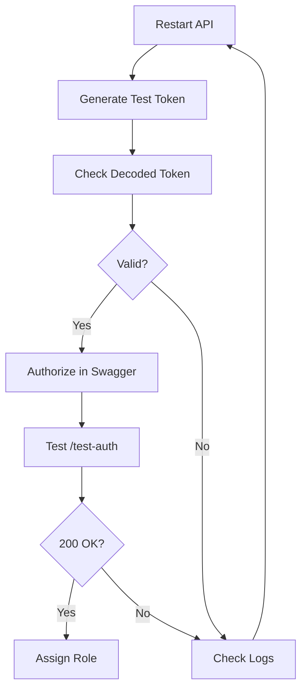

# JWT Token Fix - Final Solution

## ??????
401 Unauthorized error ???? `Bearer error="invalid_token"` ???

## Solution Steps

### Step 1: API Restart ???? (Important!)
```bash
# Terminal ? Ctrl+C ????? stop ????
# ?????:
cd C:\Users\User\source\repos\SayeedAlMasum\WorkflowManagementSystem\Workflow.Api
dotnet run
```

### Step 2: Fresh Token Generate ????

**Method 1: Normal Login**
```
POST https://localhost:7032/api/auth/login
{
  "email": "swagger@example.com",
  "password": "Swagger123456789"
}
```

**Method 2: Test Token Generator (NEW!)**
```
POST https://localhost:7032/api/auth/generate-test-token
Content-Type: application/json

"swagger@example.com"
```

??? token ?? decoded details ?? ????!

### Step 3: Token Verify ????

**NEW Debug Endpoint:**
```
GET https://localhost:7032/api/auth/debug-jwt
Authorization: Bearer YOUR_TOKEN
```

??? JWT configuration ???????

### Step 4: Swagger ? Authorize ????

1. **Logout** from previous session (if any)
2. **Authorize** button click ????
3. **????????? token paste ????** (Bearer ?????? ??):
```
eyJhbGciOiJIUzI1NiIsInR5cCI6IkpXVCJ9...
```
4. **Authorize** ? **Close**

### Step 5: Test Authentication

```
GET /api/auth/test-auth
```

**Expected Response:**
```json
{
  "authenticated": true,
  "userName": "swagger@example.com",
  "userId": "...",
  "claims": [...]
}
```

### Step 6: Assign Role

```
POST /api/auth/assign-role
{
  "userId": "target-user-id",
  "role": "Admin"
}
```

---

## Troubleshooting with New Endpoints

### 1. Generate Fresh Token with Details
```
POST /api/auth/generate-test-token
"swagger@example.com"
```

**Response:**
```json
{
  "token": "eyJhbGc...",
  "tokenExpiry": "2024-12-19T20:00:00Z",
  "decodedToken": {
    "issuer": "WorkflowManagementSystem",
    "audience": "WorkflowManagementSystemUsers",
    "expiration": "2024-12-19T20:00:00Z",
    "claims": [...]
  }
}
```

**Check:**
- ? Issuer matches config
- ? Audience matches config
- ? Expiration is future time

### 2. Debug JWT Config
```
GET /api/auth/debug-jwt
Authorization: Bearer YOUR_TOKEN
```

**Response:**
```json
{
  "issuer": "WorkflowManagementSystem",
  "audience": "WorkflowManagementSystemUsers",
  "keyLength": 69,
  "expiryMinutes": "60",
  "serverTime": "2024-12-19T14:30:00Z"
}
```

**Check:**
- ? KeyLength >= 32
- ? Server time is correct

---

## Common Issues & Fixes

### Issue 1: "IDX14100: JWT is not well formed"
**Cause:** Token incomplete or "Bearer Bearer" double prefix

**Fix:**
- Paste ONLY the token in Swagger (no "Bearer" word)
- Make sure full token is copied (200+ characters with 2 dots)

### Issue 2: Token Expired
**Symptoms:** Logs show "Token expired"

**Fix:**
- Generate fresh token using `/generate-test-token`
- Check `tokenExpiry` in response
- Make sure current time < tokenExpiry

### Issue 3: Invalid Signature
**Symptoms:** Logs show "Invalid token signature"

**Fix:**
- Restart API (ensures same key used for generation and validation)
- Verify appsettings.json has correct JWT.Key
- Generate new token after restart

### Issue 4: Issuer/Audience Mismatch
**Symptoms:** Logs show "Invalid token issuer/audience"

**Fix:**
- Compare token's issuer/audience with config
- Use `/debug-jwt` endpoint to verify
- Ensure appsettings.json values match exactly

---

## Testing Flow



---

## Quick Commands

```bash
# 1. Stop API
Ctrl+C

# 2. Start API
cd Workflow.Api
dotnet run

# 3. Wait for startup
# Look for: "Now listening on: https://localhost:7032"

# 4. Generate token with details
POST /api/auth/generate-test-token
Body: "swagger@example.com"

# 5. Copy token from response

# 6. Authorize in Swagger
# Paste token (no "Bearer")

# 7. Test
GET /api/auth/test-auth

# 8. If success, assign role
POST /api/auth/assign-role
```

---

## Logs to Check

After starting API, watch console for:

**Startup:**
```
info: Now listening on: https://localhost:7032
```

**Token Validation:**
```
? Token validated successfully for user: {userId}
? Authentication failed: {error}
? Invalid token signature
? Token expired
```

---

## Database Verification

```sql
-- Check your user and roles
SELECT 
    u.Id,
    u.Email,
    STRING_AGG(r.Name, ', ') as Roles
FROM AspNetUsers u
LEFT JOIN AspNetUserRoles ur ON u.Id = ur.UserId
LEFT JOIN AspNetRoles r ON ur.RoleId = r.RoleId
WHERE u.Email = 'swagger@example.com'
GROUP BY u.Id, u.Email;
```

---

## Security Note ??

**Remove these endpoints in production:**
- `POST /api/auth/generate-test-token` - Generates tokens without authentication
- `GET /api/auth/debug-jwt` - Exposes configuration

Add this in production `Program.cs`:
```csharp
#if DEBUG
// Only in development
app.MapControllers();
#else
// In production, exclude test endpoints
app.MapControllers()
   .RequireAuthorization(); // All endpoints require auth
#endif
```

---

## What's New?

### Added 3 Debug Endpoints:

1. **`GET /api/auth/test-auth`**
   - Tests if token is working
   - Shows user claims

2. **`POST /api/auth/generate-test-token`**
   - Generates token with decoded details
   - Helps verify token structure

3. **`GET /api/auth/debug-jwt`**
   - Shows JWT configuration
   - Verifies settings

### Enhanced Logging:
- Token validation success/failure
- Detailed error messages
- Issuer/Audience mismatches

---

## Final Checklist

Before testing:
- ? API restarted
- ? Fresh token generated
- ? Token expiry is future time
- ? Token has 2 dots (3 parts)
- ? Console shows "Now listening"

During testing:
- ? Authorized in Swagger (only token, no "Bearer")
- ? test-auth returns 200 OK
- ? Console shows "Token validated successfully"

If still failing:
- ? Check console logs for exact error
- ? Use generate-test-token to see decoded token
- ? Use debug-jwt to verify config
- ? Compare token issuer/audience with config

---

**Status:** Enhanced with debug endpoints  
**Action:** Restart API and test with new endpoints  
**Time:** 2 minutes

???? try ????! ??
